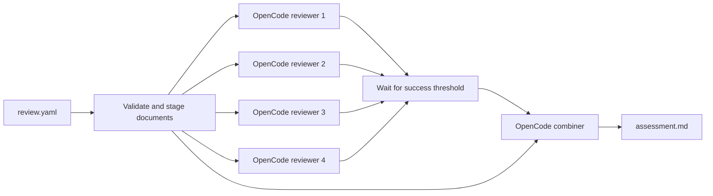

# Review Swarm: OpenCode design

Status: implemented v0.3.0  
Date: 2026-07-23

## Decision

Replace direct OpenRouter HTTP calls and hand-built repository snapshots with
OpenCode CLI sessions. Retain a small local runner because the workflow requires
an exact four-way fan-out, true concurrency, a success threshold, and a strict
fan-in barrier before the fifth (combiner) agent starts.

No larger multi-agent framework is needed. PydanticAI or LangGraph would replace
HTTP plumbing but would still require repository tools, context compaction,
permissions, and agent-session management. Community OpenCode team plugins add
background coordination useful for interactive coding, but this workload is a
fixed batch DAG and does not need agent messaging or shared mutable state.

## Execution model

The Python runner launches four `opencode run --format json` child processes via
`asyncio`. Each is a fresh session with the same system prompt, mode prompt,
attachments, and tool policy. Model, reasoning effort, and temperature are
declared independently per reviewer. The default semaphore permits all four to
run concurrently.

When a reviewer completes, the runner extracts its final text and usage events,
then writes an immutable numbered Markdown report. Only after all processes have
settled and the configured success threshold is met does the runner launch the
combiner. The numbered review files and original documents are passed with
OpenCode's `--file` option. In implementation mode, both reviewer and combiner
sessions use the implementation repository as `--dir`.

This is the automatic handoff: file attachments become native OpenCode message
parts in the fifth session. The model never has to discover task IDs, poll child
agents, or copy summaries between contexts, and the combiner cannot race ahead of
unfinished reviewers.

## Why process-level sessions

OpenCode's regular foreground Task tool returns a child result into its parent,
but historically serialized multiple tasks. Current background subagents can run
concurrently and inject results, but they remain experimental and can trigger
parent turns as individual jobs finish. That behavior is excellent for an
interactive agent but weaker for a reproducible batch barrier.

Separate `opencode run` sessions provide:

- guaranteed independent reviewer contexts;
- true parallel execution without experimental flags;
- an exact reviewer count controlled by code rather than model tool choice;
- explicit partial-failure policy;
- complete JSONL event streams per session;
- a deterministic moment at which synthesis begins.

## Context and permissions

Design and requirements documents are staged and attached to every applicable
session. For implementation conformance, OpenCode explores the repository on
demand instead of receiving a monolithic serialized snapshot. Its normal context
compaction and tool-output pruning handle long investigations.

Every runtime session receives an inline OpenCode agent configuration. Reviewer
and combiner permissions default-deny all tools, then allow only read, list, glob,
grep, and LSP. Edits, shell commands, web access, nested agents, questions, and
external-directory access remain denied. OpenCode sharing and snapshots are
disabled because this is a read-only batch job.

The fixed prompts in `src/review_swarm/prompts/` are unchanged. Input locators are
appended operationally so the agent knows which attachment is the design and
which directory is the implementation. Task-specific guidance retains its lower
precedence wrapper and is identical across reviewers and combiner.

## Configuration parity

The default topology and inference settings are:

- four independent reviewers and one combiner;
- four explicit reviewer records, each with a required model and optional
  reasoning effort and temperature;
- `deepseek/deepseek-v4-flash` reviewers and a `deepseek/deepseek-v4-pro`
  combiner through OpenRouter by default;
- `xhigh` reasoning and temperature `0.6` for the default DeepSeek reviewers;
- `xhigh` reasoning and temperature `0.2` for the combiner;
- no runner-imposed token or cost budget (provider/model limits still apply);
- all reviewers required unless an explicit lower threshold is set.

OpenCode does not expose the former per-request seed through `opencode run`, so
independence now comes from separate stochastic sessions rather than four
explicit seed values. Null inference settings are omitted rather than serialized,
which permits heterogeneous model rosters without pretending unsupported controls
are effective.

## Privacy, provenance, and accounting

For OpenRouter models, runtime config enforces `zdr` and `data_collection`, allows
endpoint fallbacks, and sets `require_parameters: false`. The last setting is
necessary because OpenCode adds family sampling defaults such as `top_k` and
`top_p` that some otherwise-compatible ZDR endpoints do not advertise; OpenRouter
may discard those sampling controls while privacy routing remains mandatory.
High-confidence secret scanning still covers attached design/requirements and
per-job guidance.
Before model calls begin, OpenCode's live catalog is checked for model existence,
tool-call support, and reasoning variants. OpenRouter's active ZDR endpoint feed
is checked for an endpoint compatible with every explicit setting. The same
preflight runs under `--check`.
Repository source is no longer copied or scanned wholesale; sensitive globs are
provided as hard review instructions and tool access cannot leave the selected
workspace.

Each run preserves resolved config, hashes, staged documents, exact effective
prompts, numbered reviews, OpenCode JSONL events, session IDs, token usage, and
the synthesized assessment. OpenCode event costs are catalog estimates, not
authoritative OpenRouter charges.

## Failure behavior

- Missing inputs or OpenCode fail during `--check` without a model call.
- Reviewer processes settle independently; one failure does not cancel evidence
  from successful peers.
- By default any reviewer failure skips synthesis. An explicit
  `minimum_successful_reviewers` permits a visibly marked partial ensemble.
- A combiner failure preserves every reviewer and event stream.
- Unique run directories prevent overwriting prior assessments.
